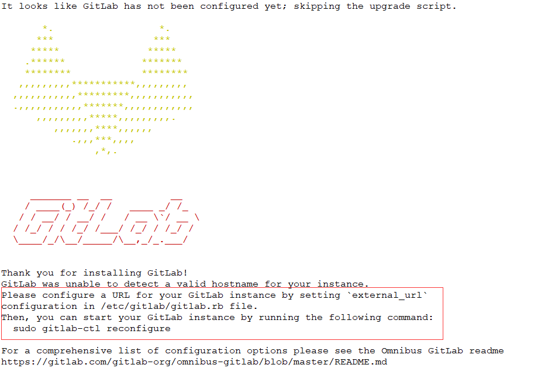

# GitHub安装
## 安装环境
（1）CentOS 6或者7    （此处使用7）
（2）2G内存（实验）生产（至少4G），不然会很卡
（3）安装包：gitlab-ce-10.2.2-ce
（4）禁用防火墙，关闭selinux
## 安装步骤
（1）安装软件
```console
[root@gitlab ~]# yum install -y curl policycoreutils-python openssh-server        #安装依赖
[root@gitlab ~]# wget https://mirrors.tuna.tsinghua.edu.cn/gitlab-ce/yum/el7/gitlab-ce-10.2.2-ce.0.el7.x86_64.rpm        #下载软件包
[root@gitlab ~]# rpm -ivh gitlab-ce-10.2.2-ce.0.el7.x86_64.rpm    #安装gitlab
```
<br/>
（2）根据安装完成提示界面进行访问URL更改及重新加载配置文件，更改次选项为自己的域名或者IP     external_url 'http://gitlab.example.com'
```console
[root@gitlab ~]# vim /etc/gitlab/gitlab.rb      #编辑配置文件  
external_url 'http://192.168.1.21'        #改为自己的IP地址
[root@gitlab ~]# gitlab-ctl reconfigure    #重新加载配置文件
```
（3）重装完成访问 http://192.168.1.21 会首先叫更改密码（root用户），改完后登录。如下界面：

（4）汉化
```console
1、下载汉化补丁
[root@gitlab ~]# git clone https://gitlab.com/xhang/gitlab.git
[root@gitlab ~]# cd gitlab    
2、查看全部分支版本
[root@gitlab ~]# git branch -a
3、对比版本、生成补丁包
[root@gitlab ~]# git diff remotes/origin/10-2-stable remotes/origin/10-2-stable-zh > /tmp/10.2.2-zh.diff
4、停止服务器
[root@gitlab ~]# gitlab-ctl stop
5、打补丁
[root@gitlab ~]# patch -d /opt/gitlab/embedded/service/gitlab-rails -p1 < /tmp/10.2.2-zh.diff
6、启动和重新配置
[root@gitlab ~]# gitlab-ctl start
[root@gitlab ~]# gitlab-ctl reconfigure
```
汉化完成后再次刷新页面如下
