# Jenkins安装
## 安装环境
（1）CentOS 7
（2）2G内存，50G磁盘
（3）安装包：jdk-8u181-linux-x64.rpm jenkins-2.99-1.1.noarch.rpm 
（4）禁用防火墙，关闭selinux
## 此案例用到的软件
（1）JDK软件包
jdk-8u181-linux-x64.rpm
链接：https://pan.baidu.com/s/1QeNSXcYpelRVrjE7A7yzBw     提取码：59xg
（2）Jenkins软件包
jenkins-2.99-1.1.noarch.rpm
链接：https://pan.baidu.com/s/180EyslbPG5z6OWBku1wQzA     提取码：ywi3
（3）Jenkins插件包
jenkins-plugins.tar.gz
链接：https://pan.baidu.com/s/1wrZfwJXhNwkO4rdxoHzCMQ     提取码：394m
## 安装步骤
### （1）安装软件jdk和jenkins
```console
1、安装JDK运行环境
[root@jenkins ~]# rpm -ivh jdk-8u181-linux-x64.rpm
2、安装jenkins
[root@jenkins ~]# rpm -ivh jenkins-2.99-1.1.noarch.rpm
3、修改启动用户为root
[root@jenkins ~]# vim /etc/sysconfig/jenkins
JENKINS_USER="root"
4、启动jenkins并加入开机启动
[root@jenkins ~]# systemctl start jenkins
[root@jenkins ~]# systemctl enable jenkins

启动前查看该目录是空的，启动后会生成相应的文件
[root@jenkins ~]# ll /var/lib/jenkins/
总用量 44
-rw------- 1 jenkins jenkins 1819 3月  27 09:04 config.xml
-rw-r--r-- 1 jenkins jenkins   29 3月  27 10:09 failed-boot-attempts.txt
-rw------- 1 jenkins jenkins  156 3月  27 09:04 hudson.model.UpdateCenter.xml
-rw------- 1 jenkins jenkins 1712 3月  26 10:04 identity.key.enc
-rw------- 1 jenkins jenkins   94 3月  26 10:04 jenkins.CLI.xml
-rw-r--r-- 1 jenkins jenkins    4 3月  26 10:04 jenkins.install.UpgradeWizard.state
drwxr-xr-x 2 jenkins jenkins    6 3月  26 10:04 jobs
drwxr-xr-x 3 jenkins jenkins   19 3月  26 10:04 logs
-rw------- 1 jenkins jenkins  907 3月  27 09:04 nodeMonitors.xml
drwxr-xr-x 2 jenkins jenkins    6 3月  26 10:04 nodes
drwxr-xr-x 2 jenkins jenkins    6 3月  26 10:04 plugins
-rw------- 1 jenkins jenkins  129 3月  27 10:07 queue.xml
-rw------- 1 jenkins jenkins  129 3月  26 12:23 queue.xml.bak
-rw------- 1 jenkins jenkins   64 3月  26 10:04 secret.key
-rw-r--r-- 1 jenkins jenkins    0 3月  26 10:04 secret.key.not-so-secret
drwx------ 4 jenkins jenkins 4096 3月  26 10:04 secrets
drwxr-xr-x 2 jenkins jenkins  100 3月  26 10:04 updates
drwxr-xr-x 2 jenkins jenkins   24 3月  26 10:04 userContent
drwxr-xr-x 3 jenkins jenkins   19 3月  26 10:04 users
```
### （2）登录web页面进行安装：http://ip:port　　(默认端口8080)
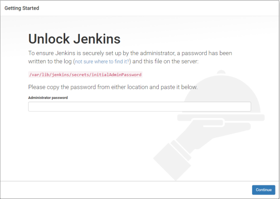
### （3）根据界面的提示信息去服务端查看密码并输入
```console
[root@jenkens ~]# cat /var/lib/jenkins/secrets/initialAdminPassword 
3629bbcd2c934badb5980ed67f1dd4f0
```
### （4）将上面的 3629bbcd2c934badb5980ed67f1dd4f0复制到输入框
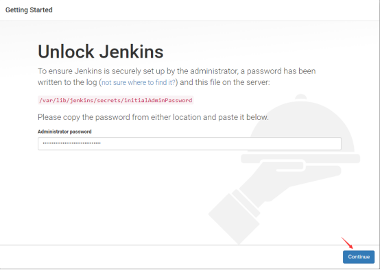
### （5）上个步骤执行成功后，会弹出下面的对话框，点击关闭即可
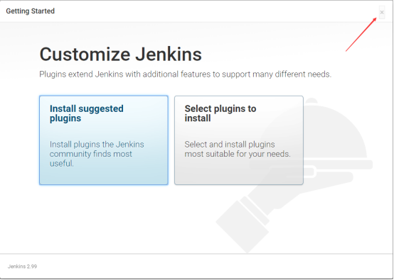
### （6）开始使用Jenkins
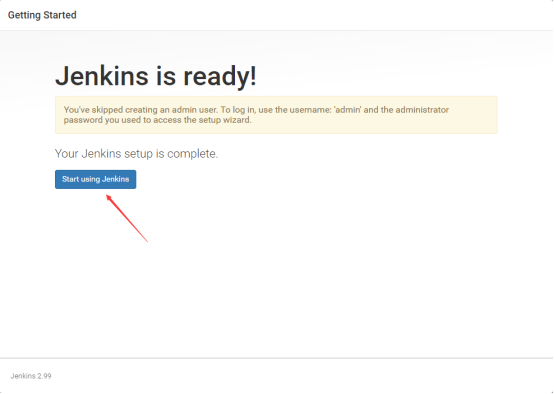
### （7）出现下面的界面，那么安装就成功了
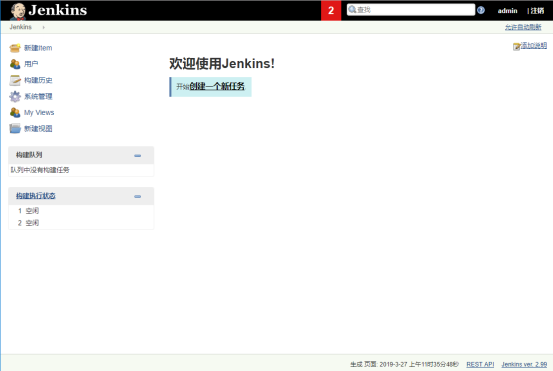
## 修改密码
### （1）点击当前用户，进入配置界面
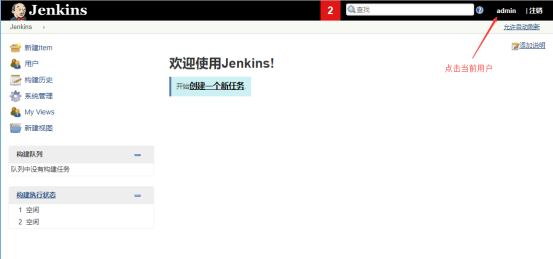
### （2）点击设置
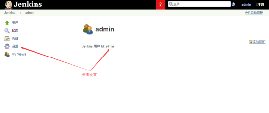
### （3）修改密码
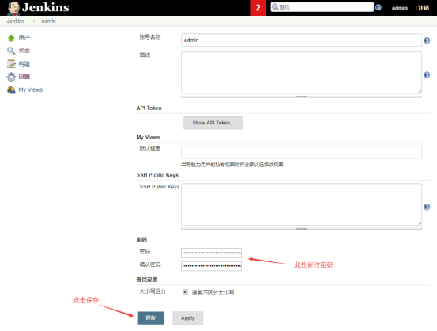
###（4）点击注销
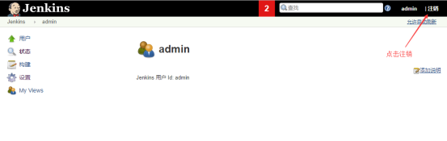
###（5）使用新密码登录Jenkins
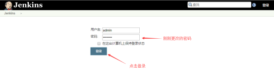
## 部署Jenkins插件
### （1）点击系统管理
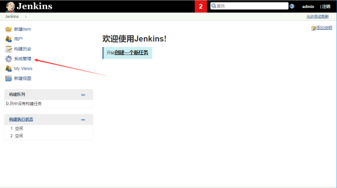
### （2）点击管理插件
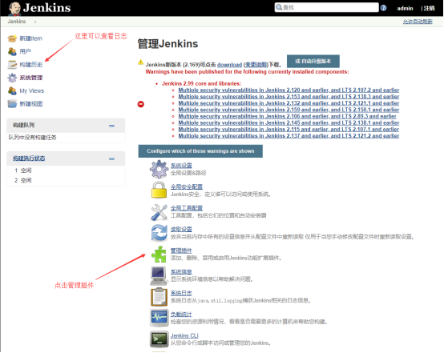
### （3）查看Jenkins已安装的插件
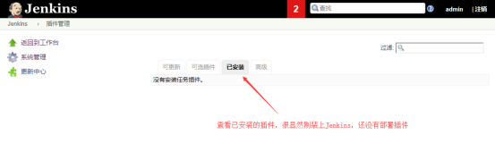
### （4）可以在webUI界面直接安装插件
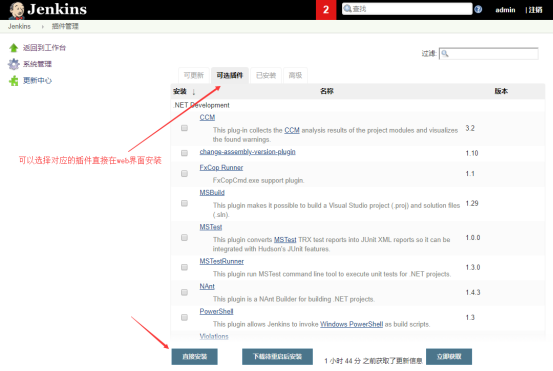
### （5）在服务端直接安装插件
```console
[root@jenkins download]# ll
总用量 160580
-rw-r--r-- 1 root root 164431230 3月  27 11:12 jenkins-plugins.tar.gz
[root@jenkins download]#
[root@jenkins download]# ll /var/lib/jenkins/plugins/          #查看Jenkins插件包的目录
总用量 0
[root@jenkins download]# tar xf jenkins-plugins.tar.gz         #解压Jenkins插件包
[root@jenkins download]# 
[root@jenkins download]# ll
总用量 160592
-rw-r--r--  1 root    root    164431230 3月  27 11:12 jenkins-plugins.tar.gz
drwxr-xr-x 97 jenkins jenkins      8192 12月  8 2017 plugins
[root@jenkins download]# 
[root@jenkins download]# ll plugins/ |wc -l                    #插件包共有191个
191
[root@jenkins download]# 
[root@jenkins download]# cp -a plugins/* /var/lib/jenkins/plugins/        #解压后的文件拷贝到Jenkins存放插件包的目录
[root@jenkins download]# 
[root@jenkins download]# ll /var/lib/jenkins/plugins/ |wc -l
191
[root@jenkins download]# 
[root@jenkins download]# /etc/init.d/jenkins restart            #重启Jenkins服务
Restarting jenkins (via systemctl):                        [  确定  ]
[root@jenkins download]#
```
### （6）再次查看web界面
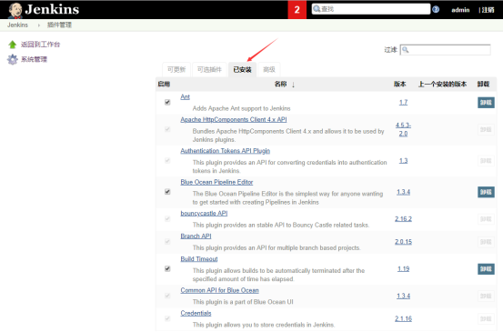
至此Jenkins就部署完成了。