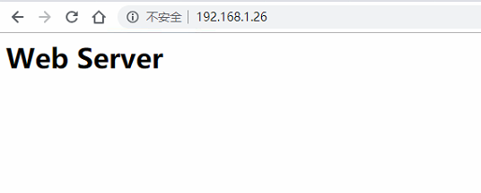

# Nginx安装
## 说明：
此处我们直接yum安装nginx，站点目录就用默认的 /usr/share/nginx/html 目录。
## 安装步骤
### （1）安装nginx并修改测试页面
```console
[root@web-nginx ~]# yum install nginx -y
[root@web-nginx ~]# ll /usr/share/nginx/
总用量 0
drwxr-xr-x. 2 root root  24 3月  29 00:13 html
[root@web-nginx ~]# echo "<h1>Web Server</h1>" > /usr/share/nginx/html/index.html
[root@web-nginx ~]# systemctl start nginx
[root@web-nginx ~]# curl -I localhost
HTTP/1.1 200 OK
Server: nginx/1.12.2
Date: Wed, 27 Mar 2019 14:37:45 GMT
Content-Type: text/html
Content-Length: 3700
Last-Modified: Tue, 06 Mar 2018 09:26:21 GMT
Connection: keep-alive
ETag: "5a9e5ebd-e74"
Accept-Ranges: bytes 
```
### （2）访问nginx服务器
