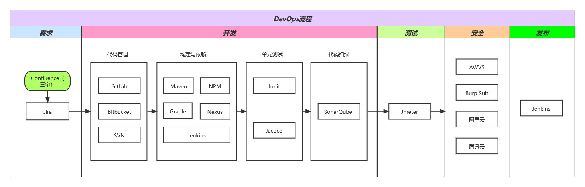
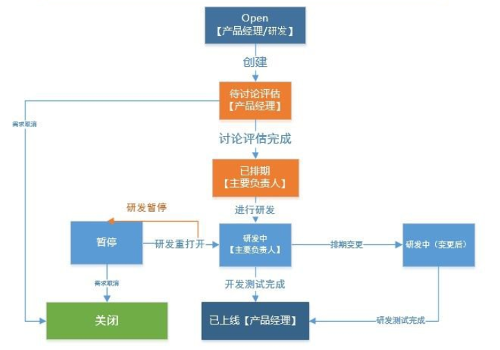
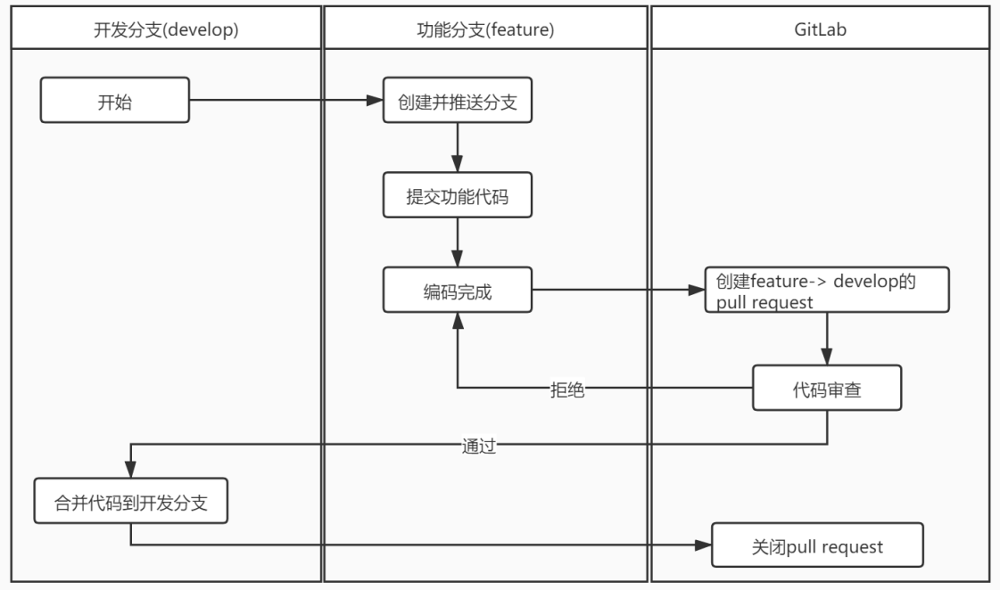
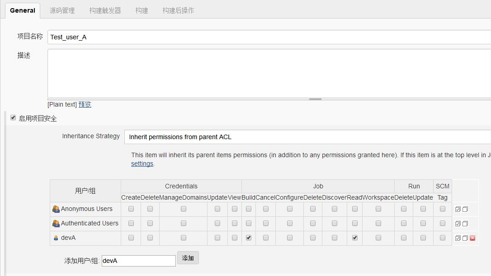
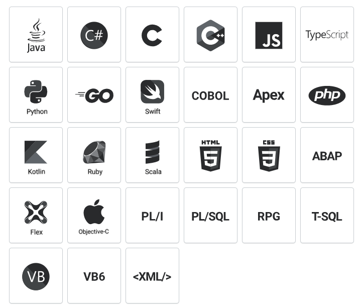
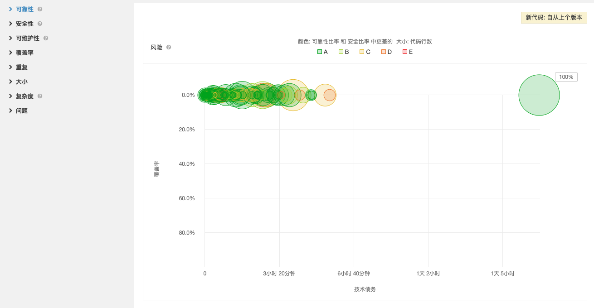
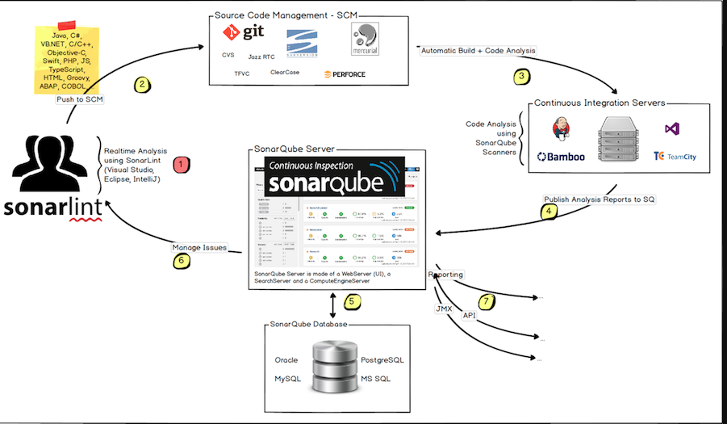
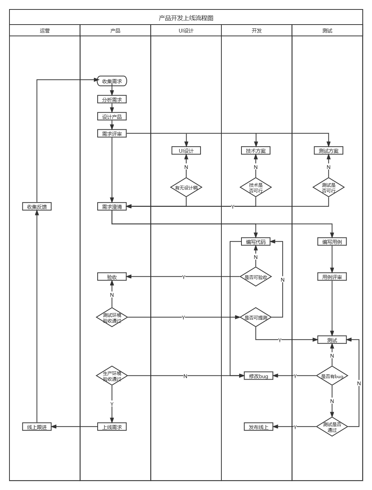

# DevOps探索与实践
## 一、背景
- 传统的研发模式和运维管理体系不适应新的商业形态下的新变化、新要求（快速响应、快速实现、高质量交付）。
- 随着劳动力成本的持续攀升，以往依靠大量人员投入的人员密集型开发和维护体系已经不堪重负；同时多年积累下的技术债务已经难以适应和满足企业数字化转型升级的要求。
- 新技术和新的研发工程实践的成熟度提供了基础。 
## 二、什么是DevOps
   DevOps是一组结合了软件开发( Dev ) 和IT 运营( Ops ) 的实践，是一项 IT 优秀实践方法，可以将开发人员与运营部门结合到一起，从而快速开发和交付新的软件功能与服务。它旨在缩短系统开发生命周期并提供具有高软件质量的持续交付。
## 三、DevOps优势
- 提高客户满意度、价值和投资回报；
- 削减开发和运营成本；
- 提高了质量，并且可以投入更多时间来实现产品和服务创新。2017 年 DevOps 状态报告表明，表现优异的组织花在计划外工作和返工上的时间比表现不佳的组织少了 21%。因此，用于新工作（比如开发新功能或代码）上的时间多了 44%；
- 缩短了开发周期（借助自动化），从而实现更快的反馈周期以及更快的产品上市速度；
- 增加了沟通和协作，从而创造以工作表现为导向的文化； 
## 四、平台建设
### 1、DevOps流程

### 2、Confluence 需求管理

### 3、GitLab 版本分支管理策略
采用以下分支体系：master 、 develop（将feature、hotfix合到develop）、release
#### 3.1、代码分支
| 分支 | 说明 | 命名规则★ |
| :----: | :---- | :----: |
| ★master | 主干分支，通常作为代码基线，所有发布的代码最终都会合并到此分支。  | Master |
| ★develop | 开发分支，通常作为其他分支的源分支，也最终会合并回此分支。 | Develop |
| feature | 功能分支，用于为未来的应用版本开发新的功能需求。 | feature_jira编号 |
| release | 发布分支，用于辅助新版本发布的准备工作，例如小bug的修复，或者版本号的修改等等。 | release_jira编号 |
| hotfix | 修复分支，用于正式版本的紧急修复。 | hotfix_jira编号 |
#### 3.2、git开发流程

### 4、Jenkins 用户和权限管理策略
用户和权限管理策略配置简单  

### 5、SoarQube
#### 5.1、SoarQube介绍
sonar是一款静态代码质量分析工具，支持Java、Python、PHP、JavaScript、CSS等25种以上的语言，而且能够集成在IDE、Jenkins、Git等服务中，方便随时查看代码质量分析报告。 

 sonar通过配置的代码分析规则，从可靠性、安全性、可维护性、覆盖率、重复率等方面分析项目，风险等级从A~E划分为5个等级；同时，sonar可以集成pmd、findbugs、checkstyle等插件来扩展使用其他规则来检验代码质量。  

#### 5.2、SoarQube工作流

 
- 开发人员在其IDE中进行编码，并使用SonarLint运行本地分析。
- 开发人员将其代码推送到仓库中：git，SVN。
- Continuous Integration Server会触发自动构建，并执行运行SonarQube分析所需的SonarScanner。
- 分析报告将发送到SonarQube服务器进行处理。
- SonarQube Server处理分析报告结果并将其存储在SonarQube数据库中，并在UI中显示结果。
- 开发人员通过SonarQube UI审查，评论，挑战他们的问题，以管理和减少技术债务。
- 经理从分析中接收报告。Ops使用API​​自动执行配置并从SonarQube提取数据。 
### 6、性能测试
基于产品用户数的预估，进行前端测试及后端接口测试，可使用以下工具：ab、wrk、jmeter
### 7、安全测试
测试过程中、上线前、上线后对代码进行安全扫描，及时修复漏洞。漏洞修复后回测，确保不影响现有业务。漏洞扫描工具：awvs、Burp Suite、T-Sec 漏洞扫描服务等等。
### 8、部署上线

## 五、Devops 环境搭建
### 1、GitHub
[GitHub安装](./GitHub.md)
### 2、Nginx
[Nginx安装](./Nginx.md)
### 3、Jenkins
[Jenkins安装](./Jenkins.md)
### 4、GitLab+Jenkins持续集成+自动化部署
[GitLab+Jenkins持续集成+自动化部署](./GitLab+Jenkins持续集成+自动化部署.md)
## 六、参考资料
[DevOps实践指南.pdf](file/DevOps实践指南.pdf)